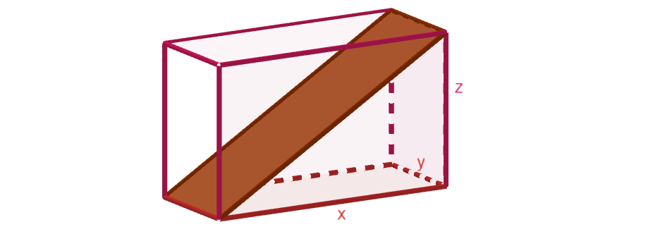

Kulmia avaruudessa
------------------

Tämän kappaleen teoria on kappaleessa `Kulmia avaruudessa <https://tim.jyu.fi/view/tau/toisen-asteen-materiaalit/matematiikka/geometria/avaruusgeometria#kulmia-avaruudessa>`__.

.. _teht_avaruuslavistaja:

Tehtävä
~~~~~~~

.. submit:: mathcheck_avaruuslavistaja 1
  :config: exercises/avaruuslavistaja/config.yaml
  

.. _teht_avaruuskulma:

Tehtävä
~~~~~~~

Suorakulmaisen särmiön muotoisen laatikon sivujen pituudet ovat :math:`x=10`, :math:`y=3` ja
:math:`z=8`. Laatikon sisään asetetaan lauta kuvan mukaisesti. Kuinka suuri on laatikon pohjan ja laudan välinen
kulma?
|image0|

.. submit:: mathcheck_avaruuslavistaja_kulma 1
  :config: exercises/avaruuslavistaja_kulma/config.yaml
  

.. _teht_pahvikuutio:

Tehtävä
~~~~~~~

Matti valmistaa pahvista kuution, jonka sivun pituus on :math:`20 \text{ cm}`.

a) Kuinka paljon pahvia tarvitaan kuution tekoon?

.. submit:: mathcheck_pahvikuutio_1 1
  :config: exercises/pahvikuutio_1/config.yaml
  

b) Matti haluaa asettaa kuution sisään mahdollisimman pitkän ohuen riman. Kuinka
   pitkä rima kuutioon mahtuu?

.. submit:: mathcheck_pahvikuutio_2 1
  :config: exercises/pahvikuutio_2/config.yaml
  

