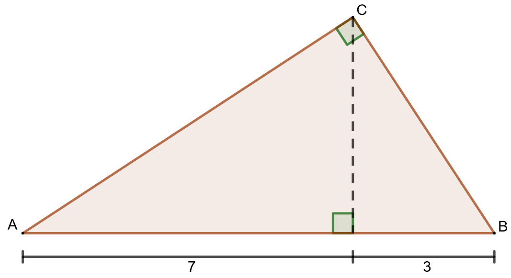

.. _kolmion-ala-teht:

Kolmion pinta-ala
-----------------

Tämän kappaleen teoria on kappaleessa `Kolmion pinta-ala <https://tim.jyu.fi/view/tau/toisen-asteen-materiaalit/matematiikka/geometria/kolmioiden-geometriaa#kolmion-ala>`__.

.. _teht_kolmion_ala:

Tehtävä
~~~~~~~

.. submit:: mathcheck_kolmion_ala1 1
  :config: exercises/kolmion_ala1/config.yaml
  

.. _teht_kolmion_korkeus:

Tehtävä
~~~~~~~

.. submit:: mathcheck_kolmion_ala2 1
  :config: exercises/kolmion_ala2/config.yaml
  

.. _teht_kolmion_kanta:

Tehtävä
~~~~~~~

.. submit:: mathcheck_kolmion_ala3 1
  :config: exercises/kolmion_ala3/config.yaml
  

.. _teht_kolmion_ala2:

Tehtävä
~~~~~~~

MathCheck laskee kulmia aina radiaaneina. Jos haluat kirjoittaa ``sin(60°)``,
sinun on kirjoitettava sen sijaan ``sin(60 * pi/180)``.

.. submit:: mathcheck_kolmion_ala4 1
  :config: exercises/kolmion_ala4/config.yaml
  

.. _teht_kolmion_ala3:

Tehtävä
~~~~~~~

Kolmion kantasivun pituus on :math:`2 \sqrt{2}` ja kolmion korkeus on :math:`\sqrt{2}`.
Laske kolmion pinta-ala.

.. submit:: mathcheck_kolmion_ala 1
  :config: exercises/kolmion_ala/config.yaml
  

.. _teht_tasasivuinen_ala:

Tehtävä
~~~~~~~

Tasasivuisen kolmion sivun pituus on ``3``. Mikä on kolmion pinta-ala?

.. submit:: mathcheck_tasasivuisen_kolmion_ala 1
  :config: exercises/tasasivuisen_kolmion_ala/config.yaml
  

.. _teht_K13T4:

Tehtävä (K2013/4)
~~~~~~~~~~~~~~~~~

Laske alla olevan kuvan suorakulmaisen kolmion :math:`ABC` pinta-alan tarkka arvo.

    

.. submit:: mathcheck_K2013T4 1
  :config: exercises/K2013T4/config.yaml
  
