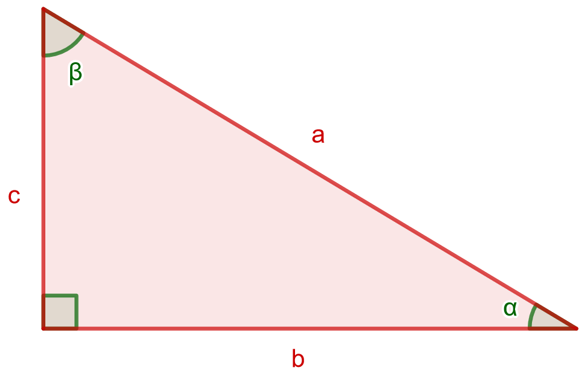
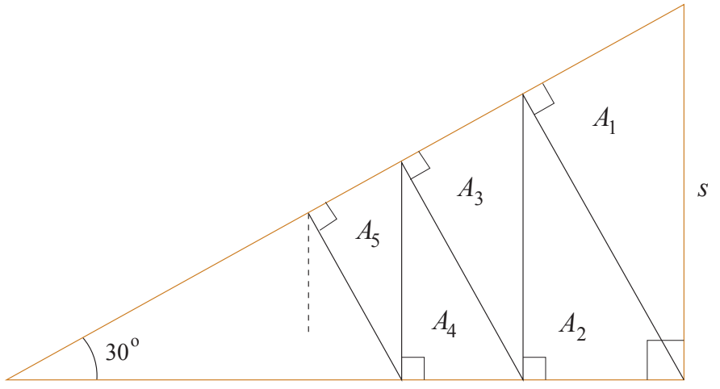

.. _trig-teht:

Trigonometriset funktiot
------------------------

Tämän kappaleen teoria on kappaleessa `Trigonometriset funktiot <https://tim.jyu.fi/view/tau/toisen-asteen-materiaalit/matematiikka/geometria/kolmioiden-geometriaa#trig>`__.

.. _teht_trig1:

Tehtävä
~~~~~~~

Tehtävien `3.2.1 <#trig1>`__-`3.2.6 <#trig6>`__ merkinnät vastaavat alla olevan kolmion merkintöjä.

    

.. submit:: mathcheck_trig1 1
  :config: exercises/trig1/config.yaml
  

.. _teht_trig2:

Tehtävä
~~~~~~~

.. submit:: mathcheck_trig2 1
  :config: exercises/trig2/config.yaml
  

.. _teht_trig3:

Tehtävä
~~~~~~~

.. submit:: mathcheck_trig3 1
  :config: exercises/trig3/config.yaml
  

.. _teht_trig4:

Tehtävä
~~~~~~~

.. submit:: mathcheck_trig4 1
  :config: exercises/trig4/config.yaml
  

.. _teht_trig5:

Tehtävä
~~~~~~~

.. submit:: mathcheck_trig5 1
  :config: exercises/trig5/config.yaml
  

.. _teht_trig6:

Tehtävä
~~~~~~~

.. submit:: mathcheck_trig6 1
  :config: exercises/trig6/config.yaml
  

.. _teht_s96T3b:

Tehtävä (s1996/3b)
~~~~~~~~~~~~~~~~~~

Katuvalaisimen kannatinvaijeri on kiinnitetty :math:`34,50 \text{ m}` leveän kadun
vastakkaisilla puolilla olevien talojen seiniin :math:`6,50 \text{ m}` korkeudelle
maasta. Lamppu riippuu vaijerista sen keskikohdalta, joka on :math:`1,10 \text{ m}`
vaijerin päitä alempana, ja vetää vaijerin puolikkaat likimain janoiksi. Kuinka
pitkä vaijeri on, ja kuinka suuren kulman vaijerin puoliskot muodostavat
keskenään?

.. submit:: mathcheck_lamppua 1
  :config: exercises/lamppua/config.yaml
  

.. submit:: mathcheck_lamppualfa 1
  :config: exercises/lamppualfa/config.yaml
  

.. _teht_K17T6:

Tehtävä (K2017/6)
~~~~~~~~~~~~~~~~~

Suorakulmaisen kolmion muotoisesta suklaalevystä lohkotaan alla olevan kuvion
mukaisesti :math:`n` kappaletta yhdenmuotoisia paloja, joiden pinta-alat ovat
:math:`A_1,A_2,A_3,\ldots,A_n`. Kuinka monta palaa suklaasta täyty lohkaista, jotta
palojen yhteenlasketut pinta-alat muodostavat vähintään :math:`97 \%` suklaalevyn
alkuperäisestä pinta-alasta?

    

.. submit:: mathcheck_suklaalevy 1
  :config: exercises/suklaalevy/config.yaml
  

.. _teht_sin18:

Tehtävä
~~~~~~~

Määritä lausekkeen :math:`\sin(18^{\circ})` tarkka arvo käyttämällä alla olevaa
tasakylkistä kolmiota.

.. raw:: html

   

Tuo hiiri tähän ladataksesi Geagebra Appin

.. raw:: html

   

.. raw:: html

   

.. raw:: html

   

.. toggle-header::
  :header: Vihje 1 **Näytä/Piilota**
  
  Ratkaise alkuperäisen kolmion kolmannen sivun pituus.
  

.. toggle-header::
  :header: Vihje 2 **Näytä/Piilota**
  
  Lisää valinta kohtaan “vihje 1”. Millainen kolmio muodostuu
  mustan janan oikealle puolelle? Voiko sitä verrata alkuperäiseen kolmioon?
  Saatko ratkaistua mustan janan pituuden?
  

.. toggle-header::
  :header: Vihje 3 **Näytä/Piilota**
  
  Pidä edelleen valinta kohdassa “Vihje 1”. Mustan janan oikealle puolelle
  muodostuu kolmio, joka on yhdenmuotoinen alkuperäisen kolmion kanssa
  (perustele tämä kulmien suuruuksien avulla). Käytä verrantoa ratkaistaksesi
  kolmion kolmannen sivun (ja samalla mustan janan) pituus.
  

.. toggle-header::
  :header: Vihje 4 **Näytä/Piilota**
  
  Lisää valinta kohtaan “Vihje 2” ja huomaa, että :math:`\frac{36^{\circ}}{2}=18^{\circ}`.
  

.. submit:: mathcheck_sin18 1
  :config: exercises/sin18/config.yaml
  
