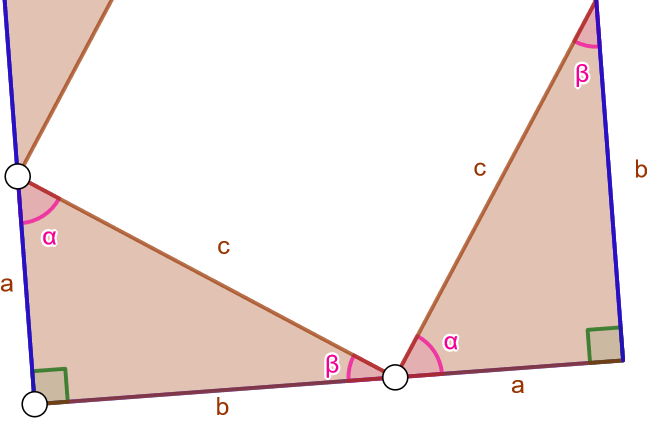

.. _pythagoras:

Suorakulmainen kolmio, Pythagoraan lause
----------------------------------------

`Suorakulmainen kolmio <https://matta.hut.fi/matta2/isom/html/kolmio2.html>`__ on
sellainen kolmio, jonka yksi kulma on suorakulma eli :math:`90^{\circ}`. Suoran kulman
kylkinä olevia sivuja kutsutaan kateeteiksi ja suoran kulman vastaista sivua
hypotenuusaksi.

Suorakulmaiseen kolmioon liittyy oleellisesti
`Pythagoraan lause <https://matta.hut.fi/matta2/isom/html/pythagor1.html>`__,
jonka mukaan suorakulmaisen kolmion kateettien neliöiden summa on yhtä suuri
kuin kolmion hypotenuusan neliö. Jos siis tiedetään kolmion kahden sivun
pituudet, voidaan kolmannen sivun pituus ratkaista. Voit lukea lisää Pythagoaan
lauseen `historiasta <https://matta.hut.fi/matta2/isom/html/pythagor1.html>`__.

.. raw:: html

   <iframe src="https://www.youtube.com/embed/I7gxwE0OsB4" height="300" width="400">

Pythagoraan lause Matikkamatskuissa

.. raw:: html

   </iframe>

.. raw:: html

   <iframe scrolling="no" title="Pythagoraan lauseen todistus" src="https://www.geogebra.org/material/iframe/id/mkv5tksu/width/790/height/581/border/888888/sfsb/true/smb/false/stb/false/stbh/false/ai/false/asb/false/sri/true/rc/false/ld/false/sdz/true/ctl/false" width="790px" height="581px" style="border:0px;">

.. raw:: html

   </iframe>

.. admonition:: **Pythagoraan lause**
  
  
  Suorakulmaisen kolmion kateettien :math:`a` ja :math:`b` neliöiden summa on yhtä suuri kuin
  sen hypotenuusan :math:`c` neliö, eli
  
  .. math:: a^2+b^2=c^2.
  
  .. figure:: ../images/187193_suorakulmainen_kolmio3.png
     :alt:  
     :width: 60.0%
  
      
  

.. toggle-header::
  :header: Esimerkki: suorakulmainen kolmio GeoGebralla. **Näytä/Piilota**
  
  .. raw:: html
  
     

  
  Tuo hiiri tähän ladataksesi Geagebra Appin
  
  .. raw:: html
  
     

  
  .. raw:: html
  
     

  
  .. raw:: html
  
     
  
  Siirrä kolmion kärkipisteitä ja huomaa, että kolmio säilyy koko ajan
  suorakulmaisena. Välillä kateettien neliöiden summa voi GeoGebran mukaan olla
  hieman eri kuin hypotenuusan neliö. Tämä johtuu siitä, että GeoGebra toteuttaa
  kaikki laskelmansa numeerisesti ja pyöristäen, joten pieniä virheitä saattaa
  esiintyä.
  
  --------------
  

.. toggle-header::
  :header: Todistus **Näytä/Piilota**
  
  .. raw:: html
  
     

  
  Tuo hiiri tähän ladataksesi Geagebra Appin
  
  .. raw:: html
  
     

  
  .. raw:: html
  
     

  
  .. raw:: html
  
     
  
  Kaikki kuviossa esiintyvät oranssit kolmiot ovat suorakulmaisia, sillä ne ovat
  neliön sisällä, ja neliön kaikki kulmat ovat :math:`90^{\circ}`. Kolmiot ovat
  samanlaisia, sillä jokaisen kolmion kateetit ovat pituuksiltaan :math:`a` ja :math:`b`, ja
  jokaisen kolmion hypotenuusan pituus on :math:`c`.
  
  Entä onko alkutilanteessa kolmioiden keskelle jäävä valkoinen alue neliö? Olkoon
  suorakulmaisen kolmion kulmat :math:`\alpha` ja :math:`\beta` kuten alla olevassa kuvassa.
  Kolmion kulmien summa on :math:`180^{\circ}`, joten saadaan seuraavat yhtälöt:
  
  .. math::
  
  
     \begin{aligned}
     \alpha + \beta + 90^{\circ} &= 180^{\circ} \quad |-90^{\circ} \\
     \alpha + \beta &= 90^{\circ}.
     \end{aligned}
  
  Kuvion alareunassa kulmat :math:`\alpha`, :math:`\beta` ja keskellä olevan valkoisen alueen
  muodostama kulma muodostavat oikokulman eli ovat yhteensä :math:`180^{\circ}`. Koska
  tiedetään, että :math:`\alpha + \beta = 90^{\circ}`, on valkoisen alueen muodostaman
  kulman oltava :math:`90^{\circ}` eli suora kulma. Koska kolmiot ovat samanlaisia, ovat
  myös valkoisen alueen muodostamat kulmat yhtä suuria, joten valkoinen alue on
  neliö.
  | |
  
  Alkutilanteessa valkoisen neliön pinta-ala on :math:`c^2`. Kun liukusäädin vedetään
  aivan oikeaan laitaan, kolmiot siirtyvät eri paikoille. Koska ne eivät mene
  päällekkäin, on valkoisen alueen pinta-ala nyt yhtä suuri kuin alussa. Nyt
  valkoinen alue muodostuu kahdesta pienestä neliöstä, joiden yhteenlaskettu
  pinta-ala on :math:`a^2+b^2`. Voidaan siis sanoa, että :math:`a^2+b^2=c^2`.
  
  --------------
  

Tähän kappaleeseen liittyvät `tehtävät <https://tim.jyu.fi/view/tau/toisen-asteen-materiaalit/matematiikka/geometria/kolmioiden-geometriaa-tehtavia#pythagoras-teht>`__.

