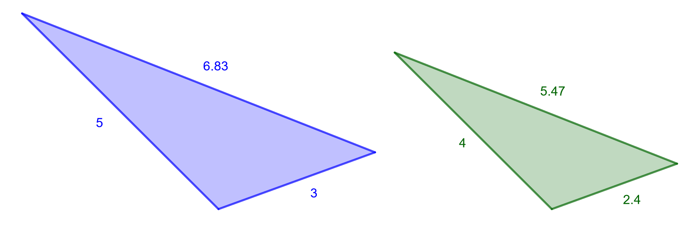

.. _mittakaava-teht:

Mittakaava eli yhdenmuotoisuussuhde
-----------------------------------

Tämän kappaleen teoria on kappaleessa `Mittakaava eli yhdenmuotoisuussuhde <https://tim.jyu.fi/view/tau/toisen-asteen-materiaalit/matematiikka/geometria/kuvioiden-yhdenmuotoisuus#mittakaava>`__.

.. _teht_mittakaava1:

Tehtävä
~~~~~~~

Määritä alla olevan kuvan kolmioiden mittakaava, kun oikeanpuoleinen kolmio
on saatu pienentämällä vasemmanpuoleinen kolmio.

    

.. submit:: mathcheck_mittakaava1a 1
  :config: exercises/mittakaava1a/config.yaml
  

.. _teht_S15T3a:

Tehtävä (S2015/3a)
~~~~~~~~~~~~~~~~~~

Kuntopolun pituus kartalla on :math:`17,5 \text{ cm}`. Mikä on polun pituus maastossa,
kun kartan mittakaava on :math:`1:20 \, 000`? Anna vastaus :math:`100` metrin tarkkuudella.

.. submit:: mathcheck_mittakaava1 1
  :config: exercises/mittakaava1/config.yaml
  

.. _teht_tyopaikan_etaisyys:

Tehtävä
~~~~~~~

Kartan mittakaava on :math:`1:80 \, 000`. Kallen työpaikan ja keskustan välimatka
kartalla on :math:`24,5 \text{ cm}`. Kuinka paljon välimatka on luonnossa?

.. submit:: mathcheck_mittakaava2 1
  :config: exercises/mittakaava2/config.yaml
  

.. _teht_suomineito:

Tehtävä
~~~~~~~

Mikä on kartan mittakaava, kun :math:`1 \, 200 \text{ km}` pitkä Suomineito on
kartalla :math:`25 \text{ cm}` mittainen?

.. submit:: mathcheck_mittakaava3 1
  :config: exercises/mittakaava3/config.yaml
  

.. _teht_kukan_suurennos:

Tehtävä
~~~~~~~

Biologian kirjassa on suurennos kukasta mittakaavassa :math:`3:1`. Jos kirjassa olevan
kukan leveys on :math:`45 \text{ mm}`, kuinka leveä on alkuperäinen kukka?

.. submit:: mathcheck_mittakaava4 1
  :config: exercises/mittakaava4/config.yaml
  

.. _teht_muurahaisen_suurennos:

Tehtävä
~~~~~~~

Seuraavalla sivulla biologian kirjassa on suurennos muurahaisesta. Suurennoksen
pituus on :math:`12 \text{ mm}`. Tekstissä kerrotaan muurahaisen pituuden luonnossa
olevan :math:`3 \text{ mm}`. Mikä on suurennoksen mittakaava?

.. submit:: mathcheck_mittakaava5 1
  :config: exercises/mittakaava5/config.yaml
  
