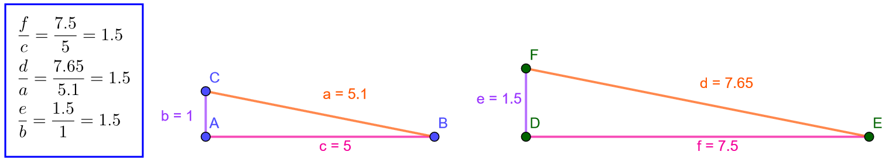

.. _mittakaava:

Mittakaava eli yhdenmuotoisuussuhde
-----------------------------------

Yhdenmuotoisissa kuvioissa vastinsivujen suhteet ovat siis vakioita.
Vastinsivut määritellään vastinpisteiden avulla. Alla olevassa kuvassa
vastinpisteitä ovat :math:`A` ja :math:`D`, :math:`E` ja :math:`B` sekä :math:`C` ja :math:`F`. Näiden avulla voidaan määrittää
vastisivut: :math:`a` ja :math:`d`, :math:`b` ja :math:`e` sekä :math:`c` ja :math:`f`. Lasketaan jokaisen
vastisivuparin suhde, ja huomataan, että se on jokaisen vastinsivuparin
tapauksessa :math:`1,5`.

   Yhdenmuotoiset kolmiot

Tätä suhdetta kutsutaan yhdenmuotoisuussuhteeksi ja se määritellään alla.

.. admonition:: **Yhdenmuotoisuussuhde eli mittakaava**
  
  
  Jos kuviot ovat yhdenmuotoiset, yhdenmuotoisuussuhde tarkoittaa suhdetta
  
  .. math:: \frac{s_1}{s_2},
  
  missä :math:`s_1` on sivun pituus ensimmäisessä kuviossa ja :math:`s_2` sitä vastaavan
  sivun pituus toisessa kuviossa.
  

.. toggle-header::
  :header: Esimerkki: yhdenmuotoisuussuhde GeoGebralla **Näytä/Piilota**
  
  .. raw:: html
  
     

  
  Tuo hiiri tähän ladataksesi Geagebra Appin
  
  .. raw:: html
  
     

  
  .. raw:: html
  
     

  
  .. raw:: html
  
     
  
  Yllä olevassa GeoGebra-appletissa on korostettu vastinpisteet ja vastinsivut
  samoilla väreillä. Lisäksi vasemmalla olevassa CAS-ikkunassa on laskettu kunkin
  vastinsivuparin suhde.
  
  Kokeile siitää kolmioiden :math:`ABC` ja :math:`DEF` kärkipisteitä ja huomaa, että
  vastinsivujen suhteet pysyvät koko ajan samoina. Tuota suhdetta kutsutaan siis
  mittakaavaksi tai yhdenmuotoisuussuhteeksi.
  
  --------------
  

Tähän kappaleeseen liittyvät `tehtävät <https://tim.jyu.fi/view/tau/toisen-asteen-materiaalit/matematiikka/geometria/kuvioiden-yhdenmuotoisuus-tehtavia#mittakaava-teht>`__.
