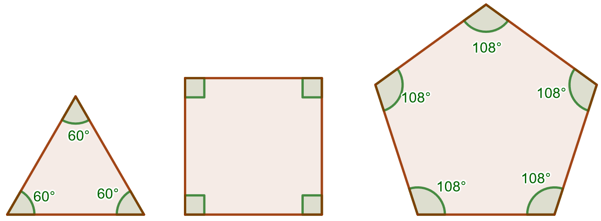
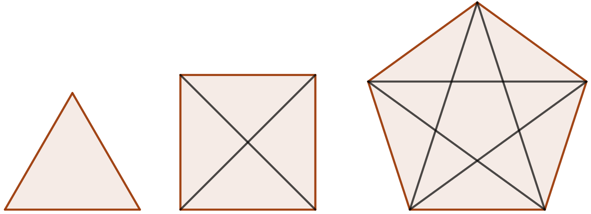

.. _muut-monikulmiot-teht:

Muut monikulmiot
----------------

Tämän kappaleen teoria on kappaleessa `Muut monikulmiot <https://tim.jyu.fi/view/tau/toisen-asteen-materiaalit/matematiikka/geometria/monikulmioiden-pinta-aloja#muut-monikulmiot>`__.

.. _teht_kulmien_summa:

Tehtävä
~~~~~~~

Johda kaava kulmien summalle monikulmiossa, jossa on :math:`n` kulmaa.

    

.. toggle-header::
  :header: Ratkaisu **Näytä/Piilota**
  
  Kun monikulmiossa on kolme kulmaa, niin :math:`n=3` ja kyseessä on kolmio. Tällöin
  kulmien summa on :math:`3 \cdot 60 ^{\circ}=180^{\circ}`. Kun monikulmiossa on neljä
  kulmaa, niin :math:`n=4` ja kyseessä on nelikulmio. Sen kulmien summa on
  :math:`4 \cdot 90 ^{\circ}=360 ^{\circ}`. Kun monikulmiossa on viisi kulmaa, niin
  :math:`n=5` ja kyseessä on viisikulmio. Sen kulmien summa on
  :math:`5 \cdot 108 ^{\circ}=540^{\circ}`.
  
  Kun tarkastellaan kulmien summasta muodostuvaa sarjaa
  :math:`180^{\circ}, 360^{\circ}, 540^{\circ} \ldots` huomataan, että kulmien summa
  kasvaa aina :math:`180^{\circ}`:lla kun kulmien määrä kasvaa yhdellä. Kaava on siis
  muotoa :math:`x \cdot 180^{\circ}`. Nyt pitää enää päätellä :math:`x`.
  
  Huomataan, että kaava toimii, jos :math:`x=n-2`. Tällöin kolmion kulmien summa on
  :math:`(3-2) \cdot 180^{\circ} = 180^{\circ}`, nelikulmion kulmien summa on
  :math:`(4-2) \cdot 180^{\circ}` :math:`= 2 \cdot 180^{\circ} =360^{\circ}` ja viisikulmion
  kulmien summa on :math:`(5-2) \cdot 180^{\circ}` :math:`= 3 \cdot 180^{\circ} =540^{\circ}`.
  Monikulmion kulmien summa on siis :math:`(n-2) \cdot 180 ^{\circ}`, missä :math:`n` on
  monikulmion kulmien määrä.
  

.. _teht_halkaisijoiden_lukumaara:

Tehtävä
~~~~~~~

Johda kaava halkaisijoiden lukumäärälle monikulmiossa, jossa on :math:`n` kulmaa.

    

.. toggle-header::
  :header: Ratkaisu **Näytä/Piilota**
  
  Kolmiossa (:math:`n=3`) halkaisijoita on :math:`0`. Nelikulmiossa (:math:`n=4`) halkaisijoita
  on :math:`2`. Viisikulmiossa (:math:`n=5`) halkaisijoita on :math:`5`.
  
  Jokaisesta monikulmion kärjestä lähtee halkaisija jokaiseen muuhun kärkeen
  paitsi niihin kahteen, jotka ovat kärjen vieressä. Jokaisesta kärjestä lähtee
  siis :math:`(n-3)` halkaisijaa (termi :math:`-3` tulee juuri siitä, ettei halkaisijaa voi
  piirtää kärkeen itseensä eikä kahteen sen viereisistä kärjistä). Koska kärkiä
  on :math:`n` kappaletta, on halkaisijoita :math:`n(n-3)` kappaletta. Jokaisella halkaisijalla
  on kuitenkin kaksi päätepistettä, eli se tulee laskettu kahteen kertaan. Siksi
  jaetaan lauseke vielä kahdella. Eli monikulmion halkaisijoiden määrä on
  :math:`\frac{n (n-3)}{2}`.
  
  Tarkistetaan vielä, että kaava toimii. Kolmion halkaisijoiden määrä on
  :math:`\frac{3 \cdot (3-3)}{2} = 0`. Nelikulmion halkaisijoiden määrä on
  :math:`\frac{4 \cdot (4-3)}{2} = 2`. Viisikulmion halkaisijoiden määrä on
  :math:`\frac{5 \cdot (5-3)}{2} = 5`. Eli kaava toimii.
  

.. _teht_viisikulmion_pinta-ala:

Tehtävä
~~~~~~~

Säännöllisen viisikulmion sivun pituus on :math:`3`. Laske viisikulmion pinta-ala.

.. submit:: mathcheck_viisikulmion_ala 1
  :config: exercises/viisikulmion_ala/config.yaml
  
