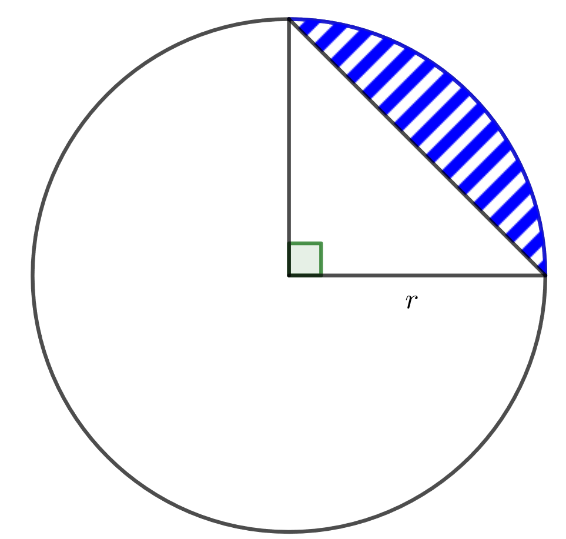
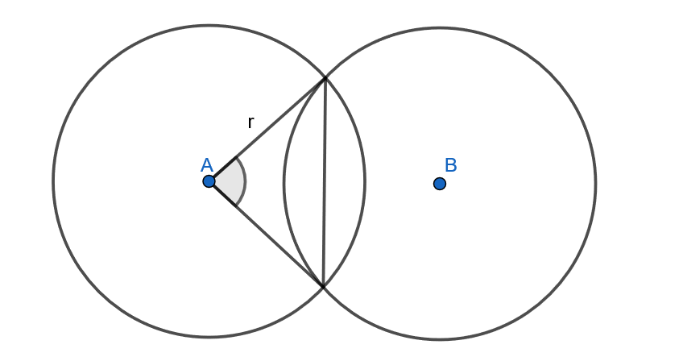

.. _janne-teht:

Jänne, segmentti
----------------

Tämän kappaleen teoria on kappaleessa `Jänne, segmentti <https://tim.jyu.fi/view/tau/toisen-asteen-materiaalit/matematiikka/geometria/ympyra#janne>`__.

.. _teht_segmentin_ala:

Tehtävä
~~~~~~~

Ympyrän säde on :math:`2` ja segmentin keskuskulman suuruus on :math:`138^{\circ}`. Mikä on
pienemmän muodostuvan segmentin pinta-ala?

.. submit:: mathcheck_segmentti1 1
  :config: exercises/segmentti1/config.yaml
  

.. _teht_suuremman_segmentin_ala:

Tehtävä
~~~~~~~

Ympyrän säde on :math:`3` ja segmentin keskuskulman suuruus on :math:`300^{\circ}`. Mikä on
suuremman muodostuvan segmentin pinta-ala?

.. submit:: mathcheck_segmentti2 1
  :config: exercises/segmentti2/config.yaml
  

.. _teht_segmentin_ala2:

Tehtävä
~~~~~~~

Ympyrän halkaisija on :math:`14`. Ympyrään on piirretty segmentti, jota vastaavan
kaaren pituus on :math:`17`. Kuinka suuri on pienemmän segmentin pinta-ala?

.. submit:: mathcheck_segmentti3 1
  :config: exercises/segmentti3/config.yaml
  

.. _teht_ympyraneljannes:

Tehtävä
~~~~~~~

Kuinka monta prosenttia ympyräneljännekseen piirretyn segmentin pinta-ala on koko
ympyrän pinta-alasta? Ympyrän säde on :math:`r`.

    

.. submit:: mathcheck_ympyraneljannes 1
  :config: exercises/ympyraneljannes/config.yaml
  

.. _teht_ark15T4:

Tehtävä (Arkkitehtivalinnan koe 2015/4)
~~~~~~~~~~~~~~~~~~~~~~~~~~~~~~~~~~~~~~~

Kaksi majakkaa sijaitsee :math:`64` kilometrin etäisyydellä toisistaan. Veneen etäisyys
merellä (tasopinta) on korkeintaan :math:`40` kilometriä kummastakin majakasta. Laske
sen alueen pinta-ala neliökilometreissä, jolla vene voi olla.

.. toggle-header::
  :header: Vihje **Näytä/Piilota**
  
  |image0|
  

.. submit:: mathcheck_majakat 1
  :config: exercises/majakat/config.yaml
  

