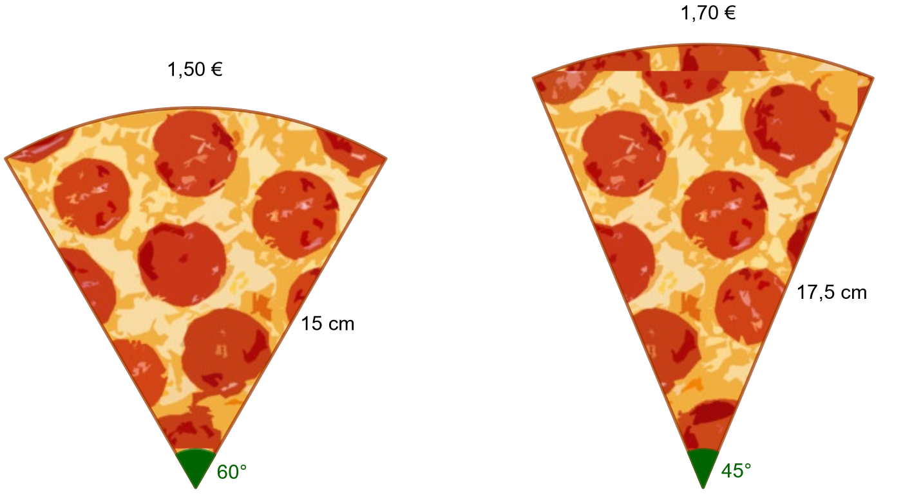
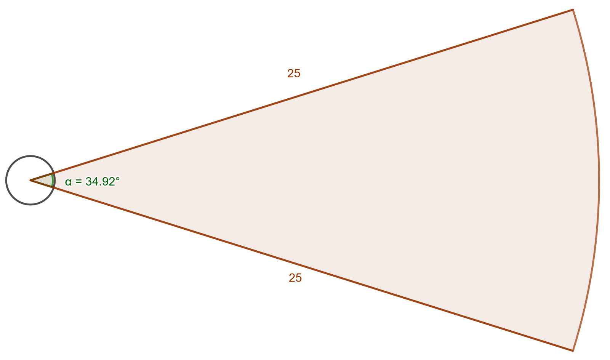
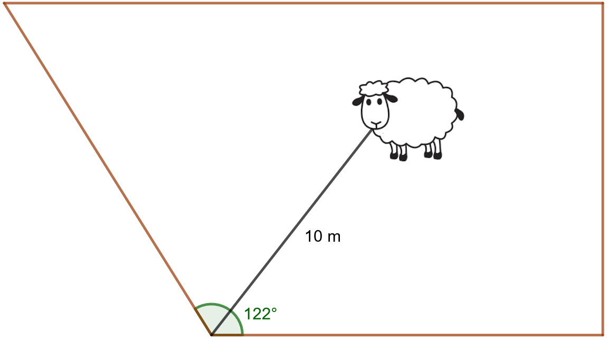
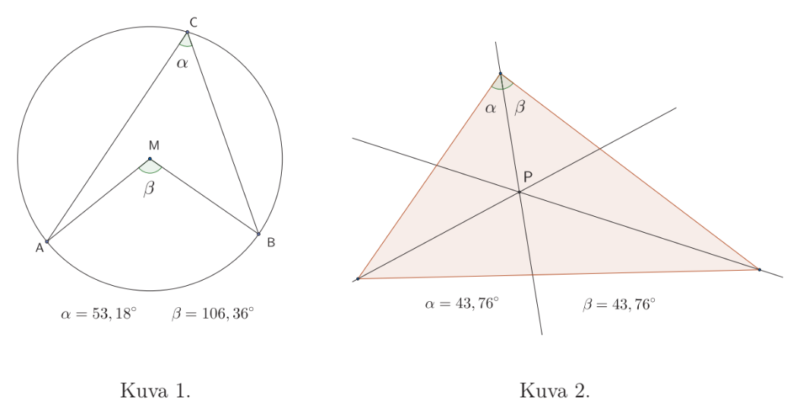

.. _keskuskulma:

Keskuskulma, kaaren pituus, sektorin pinta-ala
----------------------------------------------

Tämän kappaleen teoria on kappaleessa `Keskuskulma, kaaren pituus, sektorin pinta-ala <https://tim.jyu.fi/view/tau/toisen-asteen-materiaalit/matematiikka/geometria/ympyra#keskuskulma_kaaren_pituus>`__.

.. _teht_sektorin_ala:

Tehtävä
~~~~~~~

.. submit:: mathcheck_sektori1 1
  :config: exercises/sektori1/config.yaml
  

.. _teht_sektorin_keskuskulma:

Tehtävä
~~~~~~~

Ympyräsektorin pinta-ala on :math:`52,9` ja sen säde on :math:`5,4`. Kuinka suuri on
sektorin keskuskulma?

.. submit:: mathcheck_sektori2 1
  :config: exercises/sektori2/config.yaml
  

.. _teht_pizzapalat:

Tehtävä
~~~~~~~

Kumpi alla olevista pizzapaloista kannattaa ottaa, jos haluaa rahalleen eniten
vastinetta?

    

.. questionnaire:: pizzapalat 1

  .. pick-any:: 1

    

    *a. Vasemmanpuoleinen pala
    b. Oikeanpuoleinen pala

.. _teht_kuulantyonto:

Tehtävä
~~~~~~~

Alla on kuva kuulantyöntöringistä ja -sektorista. Ringin halkaisija on :math:`7` jalkaa
eli :math:`2,135 \text{ m}`.

    

a) Kuulantyöntösektori peitetään hiekalla. Kuinka suuri pinta-ala peitetään? Rinkiin ei laiteta hiekkaa.

.. submit:: mathcheck_kuulantyonto_a 1
  :config: exercises/kuulantyonto_a/config.yaml
  

b) Sektori ja rinki ympäröidään ulkoreunoja pitkin merkintänauhalla. Kuinka
   paljon nauhaa tarvitaan?

.. submit:: mathcheck_kuulantyonto_b 1
  :config: exercises/kuulantyonto_b/config.yaml
  

.. _teht_lammas:

Tehtävä
~~~~~~~

Lammas on kiinnitetty :math:`10 \text{ m}` pitkällä hihnalla aidoitetun alueen kulmaan.
Laske, kuinka suurelta alueelta lammas voi syödä ruohoa.

    

.. submit:: mathcheck_lammas 1
  :config: exercises/lammas/config.yaml
  

.. _teht_ark11T3:

Tehtävä (Arkkitehtivalinnan koe 2011, 3)
~~~~~~~~~~~~~~~~~~~~~~~~~~~~~~~~~~~~~~~~

Sata metriä pitkä köysi katkaistaan kahteen osaan. Toisesta osasta muodostetaan
ympyrän ja toisesta neliön piiri. Kuvioiden pinta-alojen halutaan olevan samat.
Miten naru on katkaistava?

.. toggle-header::
  :header: Vihje **Näytä/Piilota**
  
  Tee yhtälöryhmä, jossa tuntemattomat muuttujat ovat neliön sivun pituus ``a`` ja ympyrän säde ``r``.
  

.. submit:: mathcheck_sadan_metrin_koysi 1
  :config: exercises/sadan_metrin_koysi/config.yaml
  

.. _teht_S18T11:

Tehtävä (S2018/11)
~~~~~~~~~~~~~~~~~~

Alla olevien kuvioiden kaksi tilannetta ovat syntyneet erään abiturientin
harjoitellessa dynaamisen matematiikkaohjelman käyttöä. Tehtävänä on auttaa
häntä viemään tarkastelu loppuun molemmissa tapauksissa.

a) Mitä ympyrään liittyvää lausetta abiturientti tutkii kuvassa 1? Kirjoita
   lause mahdollisimman täsmällisiä termejä käyttämällä.

b) Abiturientti tarkastelee kuvassa 2 näkyvän kolmion merkillistä pistettä :math:`P`.
   Mikä tämä piste on? Minkä pisteeseen :math:`P` liittyvän geometrisen ominaisuuden
   abiturientti voi todentaa, jos hän piirtää ympyrän, jonka keskipisteenä on :math:`P`
   ja jonka säde on sopivan mittainen?

c) Perustele **joko** a-kohdan lause, kun pisteet :math:`A`, :math:`M` ja :math:`C` ovat samalla
   suoralla, **tai** b-kohdan ominaisuus.

    

.. toggle-header::
  :header: Ratkaisu **Näytä/Piilota**
  
  .. figure:: ../images/189915_2018_s_m-5.jpg
     :alt:  
  
      
  

