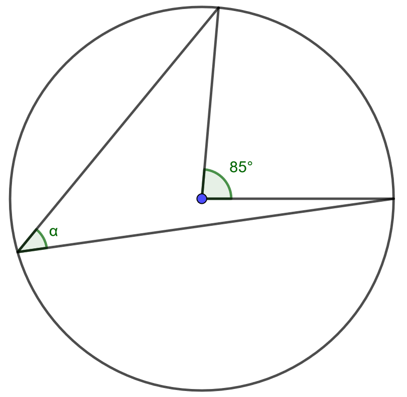
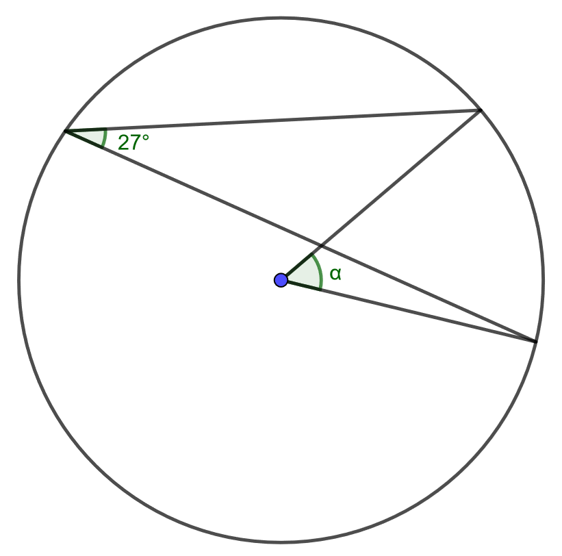
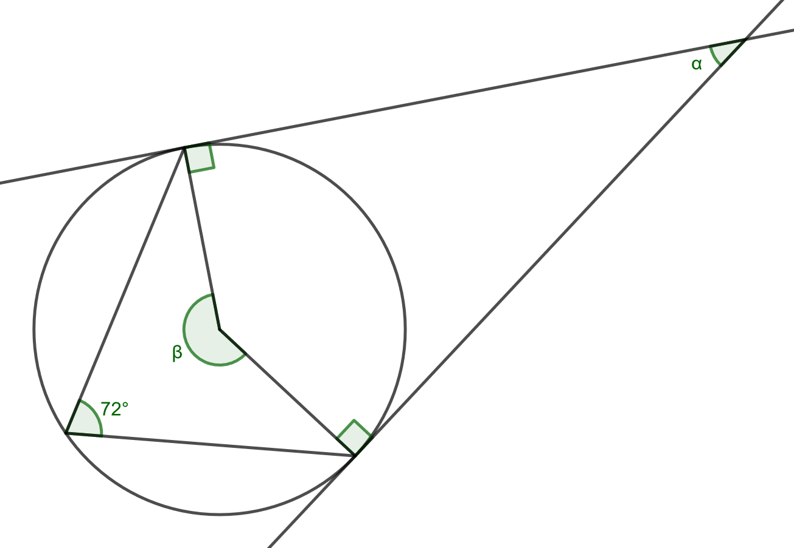
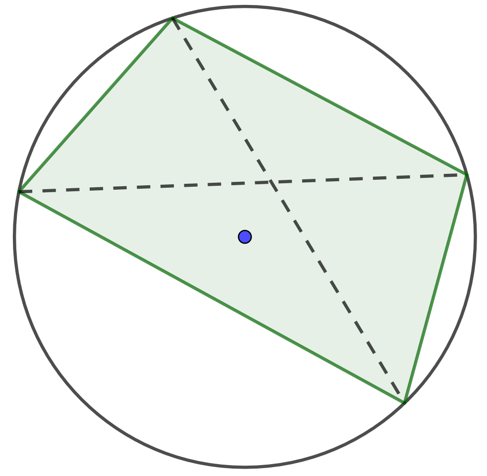

.. _keskuskulma-teht:

Keskuskulma, kehäkulma
----------------------

Tämän kappaleen teoria on kappaleessa `Keskuskulma, kehäkulma <https://tim.jyu.fi/view/tau/toisen-asteen-materiaalit/matematiikka/geometria/ympyra#keskuskulma>`__.

.. _teht_kehakulma1:

Tehtävä
~~~~~~~

Määritä kulman :math:`\alpha` suuruus.

    

.. submit:: mathcheck_kehakulma 1
  :config: exercises/kehakulma/config.yaml
  

.. _teht_kehakulma2:

Tehtävä
~~~~~~~

Määritä kulman :math:`\alpha` suuruus.

    

.. submit:: mathcheck_kehakulma_2 1
  :config: exercises/kehakulma_2/config.yaml
  

.. _teht_kehakulma3:

Tehtävä
~~~~~~~

Ratkaise alla olevasta kuvasta kulmat :math:`\alpha` ja :math:`\beta`.

    

.. submit:: mathcheck_kehakulma_3a 1
  :config: exercises/kehakulma_3a/config.yaml
  

.. submit:: mathcheck_kehakulma_3b 1
  :config: exercises/kehakulma_3b/config.yaml
  

.. _teht_jannenelikulmio:

Tehtävä
~~~~~~~

Jos nelikulmion kaikki kulmat ovat saman ympyrän kaarella, nelikulmiota kutsutaan
jännenelikulmioksi. Osoita, että jännenelikulmiossa vastakkaisten kulmien summa
on aina :math:`180 ^{\circ}`.

    

.. toggle-header::
  :header: Vihje **Näytä/Piilota**
  
  Kokeile käyttää kehäkulmalausetta.
  

.. toggle-header::
  :header: Ratkaisu **Näytä/Piilota**
  
  Käytetään alla olevan kuvan merkintöjä.
  
  .. figure:: ../images/189665_jannenelikulmio_ratk1.png
     :alt:  
     :width: 50.0%
  
      
  
  Kulmat :math:`ABD` ja :math:`ACD` ovat yhtä suuria, sillä ne ovat samaa kaarta :math:`AD`
  vastaavia kehäkulmia.
  
  .. figure:: ../images/189666_jannenelikulmio_ratk2.png
     :alt:  
     :width: 50.0%
  
      
  
  Vastaavasti kulmat :math:`BDA` ja :math:`BCA` ovat yhtä suuria, sillä ne ovat samaa kaarta
  :math:`AB` vastaavia kehäkulmia.
  
  .. figure:: ../images/189663_jannenelikulmio_ratk3.png
     :alt:  
     :width: 50.0%
  
      
  
  Kolmiosta :math:`ABD` huomataan, että :math:`DAB=180^{\circ}-(BDA+ABD)`. Aiemmista kohdista
  tiedetään, että :math:`BCD=ACD+BCA=ABD+BDA`. Sijoitetaan tämä aiempaan yhtälöön,
  jolloin saadaan :math:`DAB = 180^{\circ} - BCD` :math:`\Leftrightarrow DAB + BCD = 180^{\circ}`.
  Eli jännenelikulmion vastakkaisten kulmien summa on :math:`180^{\circ}`.
  

