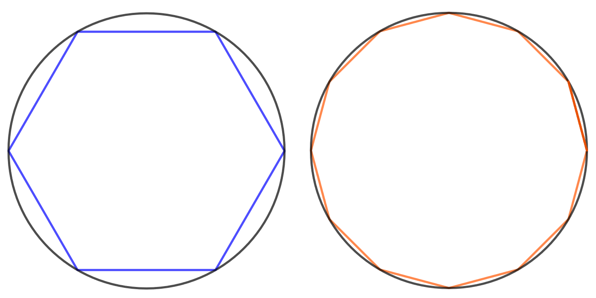
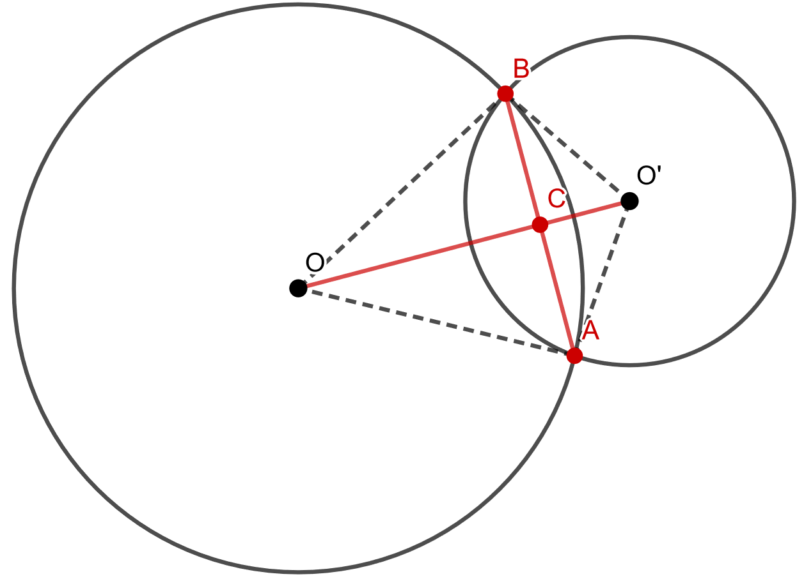

.. _sade-teht:

Säde, halkaisija, piiri
-----------------------

Tämän kappaleen teoria on kappaleessa `Säde, halkaisija, piiri <https://tim.jyu.fi/view/tau/toisen-asteen-materiaalit/matematiikka/geometria/ympyra#sade>`__.

.. _teht_puhelinlinja:

Tehtävä
~~~~~~~

Oleletaan, että maapallo on täysin pyöreä. Eräs puhelinyhtiö on vetänyt
puhelinlinjan päiväntasaajaa pitkin maapallon ympäri. Kuinka paljon linjaa
tarvitaan lisää, jos se halutaan nostaa :math:`10 \text{ m}` korkeille tolpille. Anna
vastaus metreinä ja yhden desimaalin tarkkuudella.

.. submit:: mathcheck_puhelinlinja 1
  :config: exercises/puhelinlinja/config.yaml
  

.. _teht_S18T8:

Tehtävä (S2018/8)
~~~~~~~~~~~~~~~~~

Yksikköympyrän kehän pituus on :math:`2 \pi`. Arvioi tätä lukua approksimoimalla
ympyrää sen sisään piirretyllä säännöllisellä kuusikulmiolla ja laskemalla
kuusikulmion piirin pituus. Muodosta toinen arvio säännöllisen 12-kulmion avulla
ja määritä kummankin approksimaation suhteellinen virhe vertaamalla tuloksia
laskimen antamaan lukun :math:`2 \pi` likiarvoon.

    

Huomautus: Yksikköympyrä tarkoittaa ympyrää, jonka säde on :math:`1`.

.. submit:: mathcheck_S18T8a 1
  :config: exercises/S18T8a/config.yaml
  

.. submit:: mathcheck_S18T8b 1
  :config: exercises/S18T8b/config.yaml
  

.. _teht_polkupyora:

Tehtävä
~~~~~~~

Polkupyörän renkaan koko on :math:`28"` eli sen halkaisija on :math:`28` tuumaa. Pyörään
halutaan laittaa matkamittari, jota varten tarvitaan yhdellä renkaan
pyörähdyksellä kuljettu matka. Laske pyörän yhden renkaan täydellä pyörähdyksellä
kulkema matka ja ilmoita vastaus yhden desimaalin tarkkuudella senttimetreinä.

.. submit:: mathcheck_polkupyörä 1
  :config: exercises/polkupyörä/config.yaml
  

.. _teht_pyora:

Tehtävä
~~~~~~~

Halkaisijaltaan :math:`60 \text{ cm}` pyörä pyörähtää :math:`10` kertaa. Kuinka pitkän
matkan pyörä etenee?

.. submit:: mathcheck_pyoriva_pyora_1 1
  :config: exercises/pyoriva_pyora_1/config.yaml
  

Kuinka monta pyörähdystä pyörä etenee :math:`200 \text{ m}`
matkalla?

.. submit:: mathcheck_pyoriva_pyora_2 1
  :config: exercises/pyoriva_pyora_2/config.yaml
  

.. _teht_kukkaympyra:

Tehtävä
~~~~~~~

Mari haluaa laittaa kukkia kasvamaan täsmälleen ympyrän muotoon. Hänellä on :math:`24`
kukkaa ja hän haluaa, että kukkien välinen etäisyys ympyrän kaarta pitkin
mitattuna on tasan :math:`20 \text{ cm}`. Mikä on tällaisen ympyrän halkaisija?

.. submit:: mathcheck_kukkaympyra 1
  :config: exercises/kukkaympyra/config.yaml
  

.. _teht_keskinormaali:

Tehtävä
~~~~~~~

Osoita, että kahden leikkaavan ympyrän keskipisteiden välinen jana on ympyröiden
leikkauspisteiden välisen janan keskinormaali.

Alla olevan kuvan merkinnöillä, sinun tulee osoittaa, että kuvaan punaisella
merkittyjen janojen :math:`AB` ja :math:`OO'` välinen kulma on :math:`90^{\circ}` ja että janat
:math:`BC` ja :math:`AC` ovat keskenään yhtä pitkiä.

    

.. toggle-header::
  :header: Ratkaisu **Näytä/Piilota**
  
  Tarkastellaan ensin kolmioita :math:`OO'B` ja :math:`OO'A`. Kolmioiden sivut :math:`OB` ja :math:`OA`
  ovat yhteneviä, sillä ne ovat saman ympyrän säteitä. Samoin sivut :math:`O'B` ja :math:`O'A`
  ovat yhteneviä, sillä ne ovat saman ympyrän säteitä. Sivu :math:`OO'` on molemmissa
  kolmioissa sama, joten kolmiot ovat yhteneviä (eli niiden kaikki mitat ovat yhtä
  suuria). Tällöin myös janat :math:`BC` ja :math:`AC` ovat keskenään yhtä pitkiä.
  
  Kuvassa piste :math:`C` on janojen :math:`AB` ja :math:`OO'` leikkauspiste, jolloin kulmat :math:`BCO`
  ja :math:`OCA` muodostavat oikokulman. Tarkastellaan seuraavaksi kolmioita :math:`BCO` ja
  :math:`ACO`. Sivut :math:`OB` ja :math:`OA` ovat yhteneviä (kuten aiemmin todettiin). Lisäksi
  sivu :math:`OC` on yhteinen kummallekin kolmiolle. Lisäksi kulmat :math:`COB` ja :math:`AOC`
  ovat yhteneviä, sillä kolmiot :math:`OO'B` ja :math:`OO'A` ovat yhteneviä (kuten aiemmin
  todettiin). Näin ollen kolmioiden :math:`BCO` ja :math:`ACO` on oltava yhtenevät ja kulmien
  :math:`BCO` ja :math:`OCA` on myös oltava yhtenevät. Tällöin
  :math:`BCO=OCA = \frac{180^{\circ}}{2}=90^{\circ}`.
  

