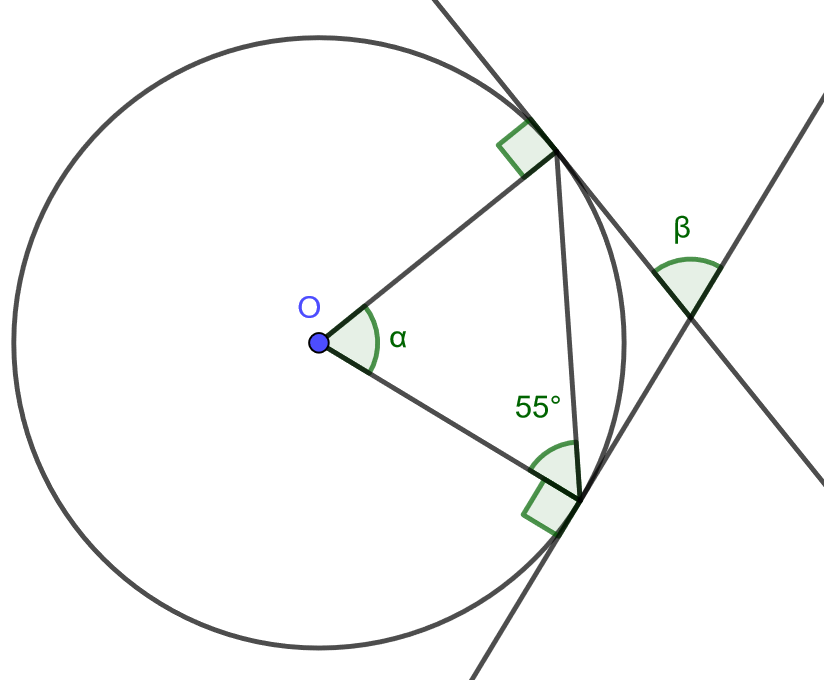
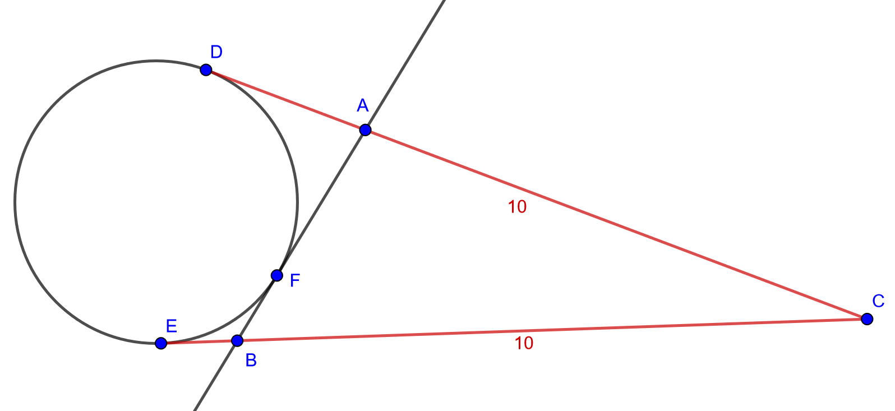

.. _tangentti-teht:

Tangentti, tangenttikulma
-------------------------

Tämän kappaleen teoria on kappaleessa `Tangentti, tangenttikulma <https://tim.jyu.fi/view/tau/toisen-asteen-materiaalit/matematiikka/geometria/ympyra#tangentti>`__.

.. _teht_tangenttikulma1:

Tehtävä
~~~~~~~

Ratkaise alla olevasta kuvasta :math:`\alpha` ja :math:`\beta`.

    

.. submit:: mathcheck_tangenttikulmat1 1
  :config: exercises/tangenttikulmat1/config.yaml
  

.. submit:: mathcheck_tangenttikulmat2 1
  :config: exercises/tangenttikulmat2/config.yaml
  

.. _teht_vesitorni:

Tehtävä
~~~~~~~

Kuinka pitkälle :math:`53 \text{ m}` korkeasta vesitornista voi nähdä? Maapallon säde
on :math:`6370 \text{ km}`. Oletetaan, että katsojan silmät ovat myös :math:`53 \text{ m}`
korkeudella maan pinnasta. Piirrä ensin mallikuva tilanteesta.

.. toggle-header::
  :header: Mallikuva **Näytä/Piilota**
  
  Huom! Mallikuva ei ole mittakaavassa!
  
  Tehtävässä tulee ratkaista kuvaan merkitty pituus :math:`x`.
  
  .. figure:: ../images/190190_vesitorni.png
     :alt:  
     :width: 60.0%
  
      
  

.. submit:: mathcheck_vesitorni 1
  :config: exercises/vesitorni/config.yaml
  

.. _teht_tangenttikulma2:

Tehtävä
~~~~~~~

Ympyrälle piirretään tangentit kehän ulkopuolisesta pisteestä :math:`C`. Tangenttien
sivuamispisteet :math:`E` ja :math:`D` ovat etäisyydellä :math:`10` pisteestä :math:`C`. Piirretään
ympyrälle vielä yksi tangentti pisteen :math:`F` kautta. Olkoon tämän tangentin ja
aiempien tangenttien leikkauspisteet :math:`A` ja :math:`B`. Laske kolmion :math:`ABC` piiri. [H]

    

.. toggle-header::
  :header: Vihje **Näytä/Piilota**
  
  Pisteet A, B ja C ovat tangenttikulmien kärkiä, eli ne ovat yhtä etäällä molemmista tangenttipisteistään.
  

.. submit:: mathcheck_tangenttikolmio 1
  :config: exercises/tangenttikolmio/config.yaml
  
